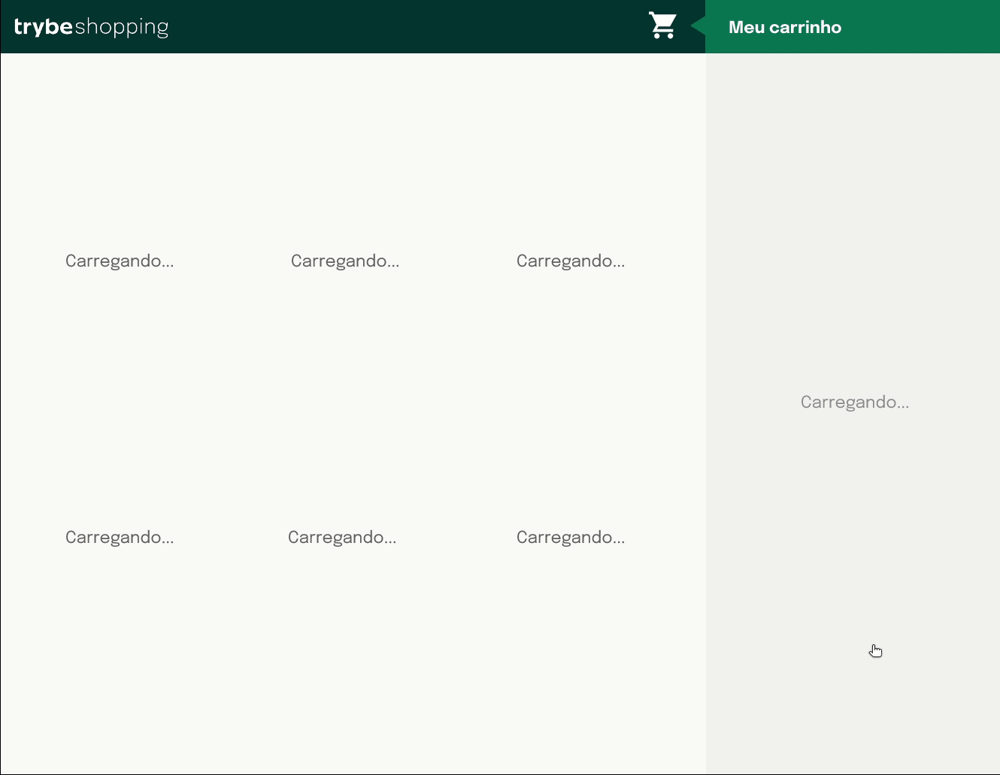

<h1>Projeto Shopping Cart</h1>

<h2>Oque foi desenvolvido:</h2>
<ul>
    <li>Fazer requisições a uma API (Application Programming Interface) do Mercado Livre</li>
    <li>Utilizar conhecimentos sobre JavaScript, CSS e HTML</li>
    <li>Trabalhar com funções assíncronas</li>
    <li>Implementar testes unitários</li>
</ul>

Projeto desenvolvido em: 05/06/2022
